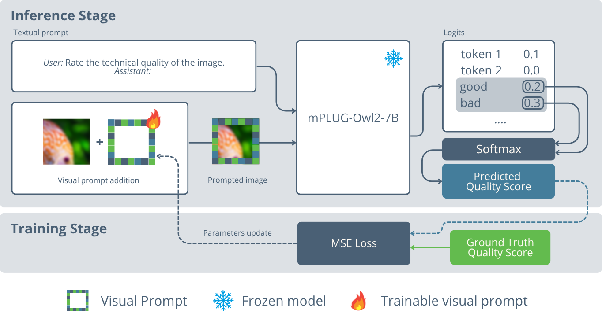

# Parameter-Efficient Adaptation of mPLUG-Owl2 via Pixel-Level Visual Prompts for NR-IQA

<!-- TODO: Add paper image/figure here -->


<!-- TODO: Add authors with links -->
**Authors**: [Yahya Benmahane](https://www.linkedin.com/in/yahya-benmahane/), [Mohammed El Hassouni](https://scholar.google.com/citations?user=aIwj9L0AAAAJ&hl=fr)

**Paper**: [Link to Paper](https://arxiv.org/abs/xxxx.xxxxx) | **Checkpoints**: [HuggingFace Hub](https://huggingface.co/your-username/pixelprompt-checkpoints)

**Abstract**: In this paper, we propose a novel parameter-efficient adaptation method for No-Reference Image Quality Assessment (NR-IQA) using visual prompts optimized in pixel-space. Unlike full fine-tuning of Multimodal Large Language Models (MLLMs), our approach trains only $\sim600$K parameters at most ($<0.01\%$ of the base model), while keeping the underlying model fully frozen. During inference, these visual prompts are combined with images via addition and processed by mPLUG-Owl2 with the textual query ``Rate the technical quality of the image." Evaluations across distortion types (synthetic, realistic, AI-generated) on KADID-10k, KonIQ-10k, and AGIQA-3k demonstrate competitive performance against full finetuned methods and specialized NR-IQA models, achieving 0.91 SRCC on KADID-10k. To our knowledge, this is the first work to leverage pixel-space visual prompts for NR-IQA, enabling efficient MLLM adaptation for low-level vision tasks.

---

This repository implements our proposed method, a novel parameter-efficient adaptation method for No-Reference Image Quality Assessment (NR-IQA) using visual prompts optimized in pixel-space. Unlike full fine-tuning of Multimodal Large Language Models (MLLMs), our approach optimizes a negligible number of learnable parameters while keeping the base MLLM entirely frozen.

## 🔥 Key Features

- **Parameter-Efficient**: Only 170K trainable parameters vs 7B+ for full fine-tuning
- **Competitive Performance**: Achieves 0.91 SROCC on KADID-10k dataset
- **Multiple Visual Prompt Types**: Padding, Fixed Patches (Center/Top-Left), Full Overlay
- **Multiple MLLM Support**: mPLUG-Owl2-7B and LLaVA-1.5-7B
- **Comprehensive Evaluation**: Supports KADID-10k, KonIQ-10k, and AGIQA-3k datasets
- **Pre-trained Checkpoints**: Available on HuggingFace Hub for immediate use

## 📋 Table of Contents

- [Installation](#installation)
- [Dataset Setup](#dataset-setup)
- [Pre-trained Checkpoints](#pre-trained-checkpoints)
- [Quick Start](#quick-start)
- [Training](#training)
- [Inference](#inference)
- [Configuration](#configuration)
- [Visual Prompt Types](#visual-prompt-types)
- [Results](#results)
- [Contact](#contact)
- [Citation](#citation)

## 🚀 Installation

### Prerequisites

- Python 3.10+
- CUDA-capable GPU (tested on NVIDIA RTX A6000)
- PyTorch
- HuggingFace Transformers

### Setup Environment

#### For mPLUG-Owl2:
```bash
# Clone and setup mPLUG-Owl2
git clone https://github.com/X-PLUG/mPLUG-Owl.git
cd mPLUG-Owl/mPLUG-Owl2
conda create -n mplug_owl2 python=3.10 -y
conda activate mplug_owl2
pip install --upgrade pip
pip install -e .
pip install 'numpy<2'
pip install protobuf
```

#### Additional Dependencies:
```bash
pip install PyYAML scikit-learn tqdm
```

## 📊 Dataset Setup

### Download Datasets

Download the required IQA datasets:

```bash
# KonIQ-10k
wget https://huggingface.co/datasets/chaofengc/IQA-PyTorch-Datasets/resolve/main/koniq10k.tgz
tar -xzf koniq10k.tgz

# KADID-10k  
wget https://huggingface.co/datasets/chaofengc/IQA-PyTorch-Datasets/resolve/main/kadid10k.tgz
tar -xzf kadid10k.tgz

# AGIQA-3K
wget https://huggingface.co/datasets/chaofengc/IQA-PyTorch-Datasets/resolve/main/AGIQA-3K.zip
unzip AGIQA-3K.zip
```

### Dataset Organization

After extraction, organize your datasets in the `data/` folder as follows:

```
data/
├── kadid10k/
│   ├── images/           # All KADID-10k images
│   └── split_kadid10k.csv
├── koniq10k/
│   ├── 512x384/          # KonIQ-10k images (comes with own split)
│   └── koniq10k_*.csv    # Original split files
└── AGIQA-3K/
    ├── images/           # All AGIQA-3k images
    └── split_agiqa3k.csv
```

**Important Notes:**
- **KADID-10k**: Move `split_kadid10k.csv` into the `kadid10k/` folder
- **KonIQ-10k**: Uses its own original split files, no need to move
- **AGIQA-3k**: Move `split_agiqa3k.csv` into the `AGIQA-3K/` folder; images are in the `images/` subfolder

## 🤗 Pre-trained Checkpoints

We provide pre-trained visual prompt checkpoints on **HuggingFace Hub** for immediate use:

🔗 **[Download Checkpoints](https://huggingface.co/your-username/pixelprompt-checkpoints)**

### Available Checkpoints

The checkpoints are provided as `visual_prompt_ckpt_trained_on_mplug2.zip` containing training experiment folders with checkpoint directories (`checkpoint-xxxx`). Each experiment folder contains multiple epochs, and the best performing checkpoint can be identified from the `best_model_checkpoint` info in the final checkpoint folder.

| Dataset | Visual Prompt | Size | Mode | SROCC | Experiment Folder |
|---------|---------------|------|------|-------|-------------------|
| KADID-10k | Padding | 30px | Add | 0.910 | `SGD_mplug2_exp_04_kadid_padding_30px_add/` |
| KonIQ-10k | Padding | 30px | Add | 0.852 | `SGD_mplug2_exp_05_koniq_padding_30px_add/` |
| AGIQA-3k | Padding | 30px | Add | 0.810 | `SGD_mplug2_exp_06_agiqa_padding_30px_add/` |

### Using Pre-trained Checkpoints

1. **Download and extract the checkpoint archive**:
```bash
# Download from HuggingFace Hub
wget https://huggingface.co/your-username/pixelprompt-checkpoints/resolve/main/visual_prompt_ckpt_trained_on_mplug2.zip
unzip visual_prompt_ckpt_trained_on_mplug2.zip
```

2. **Navigate to the desired experiment folder**:
```bash
cd SGD_mplug2_exp_04_kadid_padding_30px_add/
# Check the latest checkpoint folder (highest number)
ls -la checkpoint-*/
# Look for best_model_checkpoint info in the final checkpoint
```

3. **Update the checkpoint path** in `src/tester.py`:
```python
visual_prompt_path = "SGD_mplug2_exp_04_kadid_padding_30px_add/checkpoint-XXXX/visual_prompt.pth"
```

4. **Run inference** as described in the [Inference](#inference) section.

## 🏃 Quick Start

### 1. Training a Visual Prompt

```bash
cd src
python trainer.py 1
```

This runs experiment #1 from the predefined experiment list. The experiment ID maps to specific configurations in `trainer.py`.

### 2. Custom Training

Create a custom configuration file based on the examples in `configs/`:

```bash
# Copy an existing config
cp configs/mplug_owl2_configs/SGD_mplug2_exp_01_kadid_padding_10px_add.yaml configs/my_experiment.yaml
# Edit the configuration
# Run training by modifying the config path in trainer.py
```

### 3. Inference

```bash
cd src
python tester.py
```

Modify the config path and checkpoint path in `tester.py` for your specific experiment.

## 🎯 Training

### Training Process

The training uses HuggingFace's `Trainer` with custom components:

1. **Model**: `VLMWithVisualPrompt` - combines frozen MLLM + trainable visual prompt
2. **Loss**: Mean Squared Error (MSE) between predicted and ground truth quality scores  
3. **Metrics**: SRCC and PLCC correlation coefficients
4. **Optimization**: SGD optimizer with configurable learning rates

### Key Training Parameters

- **Batch Size**: 32 (KADID-10k), 4 (KonIQ-10k, AGIQA-3k)
- **Learning Rate**: 60 (KADID-10k), varies by dataset
- **Epochs**: 25 (KADID-10k), 35 (AGIQA-3k)
- **Optimizer**: SGD

### Training Command

```bash
cd src
python trainer.py <experiment_number>
```

Where `<experiment_number>` corresponds to predefined experiments (1-33):
- All experiments use mPLUG-Owl2-7B with different visual prompt configurations
- Covers all combinations of datasets, prompt types, sizes, and modes

## 🔍 Inference

### Running Inference

1. **Modify** `src/tester.py` to specify:
   - Configuration file path
   - Checkpoint path for trained visual prompt
   
2. **Run inference**:
```bash
cd src
python tester.py
```

### Output

The inference script outputs:
- SRCC (Spearman Rank Correlation Coefficient)
- PLCC (Pearson Linear Correlation Coefficient)

## ⚙️ Configuration

### Configuration File Structure

```yaml
experiment_name: "my_experiment"
model:
  vlm_name: "mplug2"  # mPLUG-Owl2-7B
  visual_prompt:
    type: "padding"    # padding, patch_center, patch_topleft, overlay
    args:
      size: 30         # prompt size in pixels
      delta: 1         # scaling factor
      mode: "add"      # add or mul
      is_center: true  # for patch prompts
quality_score_type: "good+fine_vs_poor+bad"
training:
  output_dir: "outputs/my_experiment"
  num_train_epochs: 25
  learning_rate: 60
  per_device_train_batch_size: 32
  # ... other training parameters
dataset:
  train:
    path: "./data"
    name: "kadid"     # kadid, koniq, agiqa
    split: "train"
  # ... eval and test splits
```

### Quality Score Types

Available quality score extraction methods:
- `"good+fine_vs_poor+bad"`
- `"excellent+good_vs_poor+bad"`  
- `"good_vs_bad"`
- `"good_vs_poor"`
- `"fine_vs_poor"`
- `"excellent_vs_bad"`

## 🎨 Visual Prompt Types

### 1. Padding
Adds learnable pixels around image borders.
- **Sizes**: 10px, 30px
- **Parameters**: `3 × 2S(W + H - S)` where S=size, W=width, H=height

### 2. Fixed Patch (Center)
Places a learnable square patch at image center.
- **Sizes**: 10px, 30px  
- **Parameters**: `3 × S²`

### 3. Fixed Patch (Top-Left)
Places a learnable square patch at top-left corner.
- **Sizes**: 10px, 30px
- **Parameters**: `3 × S²`

### 4. Full Overlay
Applies learnable prompt across entire image.
- **Parameters**: `3 × H × W`

### Combination Modes
- **Addition**: `prompted_image = image + prompt`
- **Multiplication**: `prompted_image = image × prompt`

## 📈 Results

### Best Performance (30px Padding + Addition)

| Dataset | SROCC | PLCC | Parameters |
|---------|-------|------|------------|
| KADID-10k | 0.910 | 0.905 | 600K |
| KonIQ-10k | 0.852 | 0.874 | 600K |
| AGIQA-3k | 0.810 | 0.860 | 600K |

### Comparison with Full Fine-tuning

| Method | Parameters | KADID-10k SROCC |
|--------|------------|------------------|
| Our Proposed Method | 600K | 0.910 |
| Q-Align | 7B | 0.919 |
| Q-Instruct | 7B | 0.706 |

## 🗂️ Repository Structure

```
├── src/
│   ├── trainer.py              # Main training script
│   ├── tester.py               # Inference script  
│   ├── vlms_plus_prompters.py  # Combined VLM+Prompt model
│   ├── vlms.py                 # Individual VLM implementations
│   ├── prompters.py            # Visual prompt modules
│   ├── datasets.py             # Dataset loading
│   ├── collators.py            # Data collation
│   └── utils.py                # Utility functions
├── configs/
│   └── mplug_owl2_configs/     # mPLUG-Owl2 configurations (33 experiments)
├── data/                       # Dataset files and splits
├── outputs/                    # Training outputs and checkpoints
└── README.md
```

## ⚠️ Important Notes

1. **GPU Memory**: Training requires significant GPU memory due to MLLM size
2. **Gradient Flow**: Standard image processors break gradients - our implementation preserves them
3. **Model Focus**: This codebase focuses on mPLUG-Owl2-7B for best performance
4. **Hyperparameters**: Learning rates and batch sizes are dataset-specific

## 🔬 Reproducing Results

To reproduce the paper results:

1. **Setup environment** following installation instructions
2. **Download and organize datasets** in `data/` folder following the structure above
3. **Run predefined experiments**:
   ```bash
   # Best results: 30px padding with addition
   python trainer.py 5   # KonIQ-10k + 30px padding
   python trainer.py 4   # KADID-10k + 30px padding  
   python trainer.py 6   # AGIQA-3k + 30px padding
   ```
4. **Evaluate** using `tester.py` with corresponding checkpoints

## 📝 Citation

If you use this code in your research, please cite:

```bibtex
@article{}
```

## 🤝 Contributing

Contributions are welcome! Please:
1. Fork the repository
2. Create a feature branch
3. Make your changes  
4. Submit a pull request

## 📄 License

...

## 🙏 Acknowledgments

- [mPLUG-Owl2](https://github.com/X-PLUG/mPLUG-Owl) for the base multimodal LLM
- [LLaVA](https://github.com/haotian-liu/LLaVA) for the alternative MLLM implementation
- HuggingFace Transformers for the training framework
- [I have to reference visual prompting]


